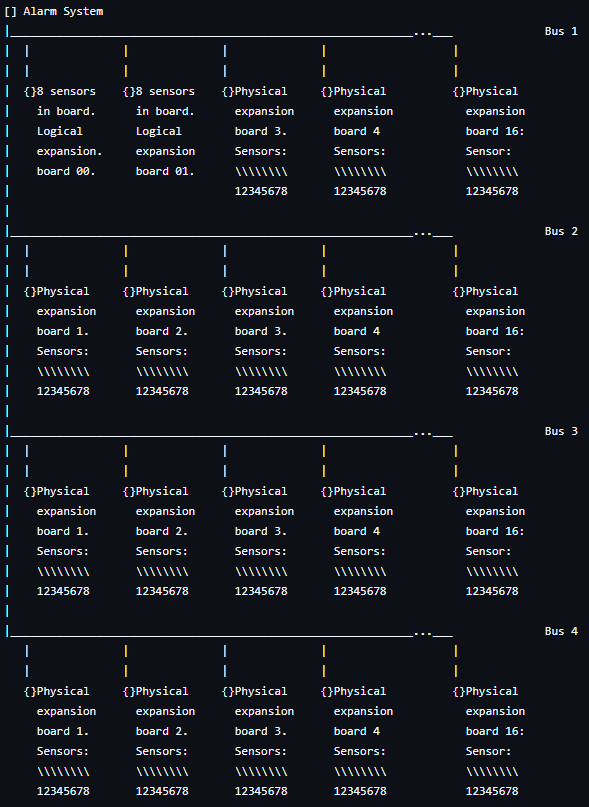
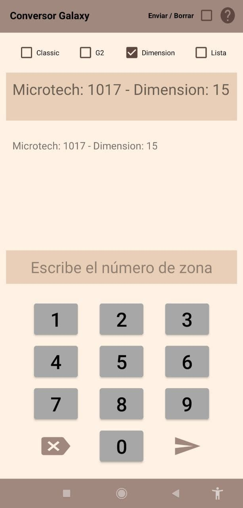
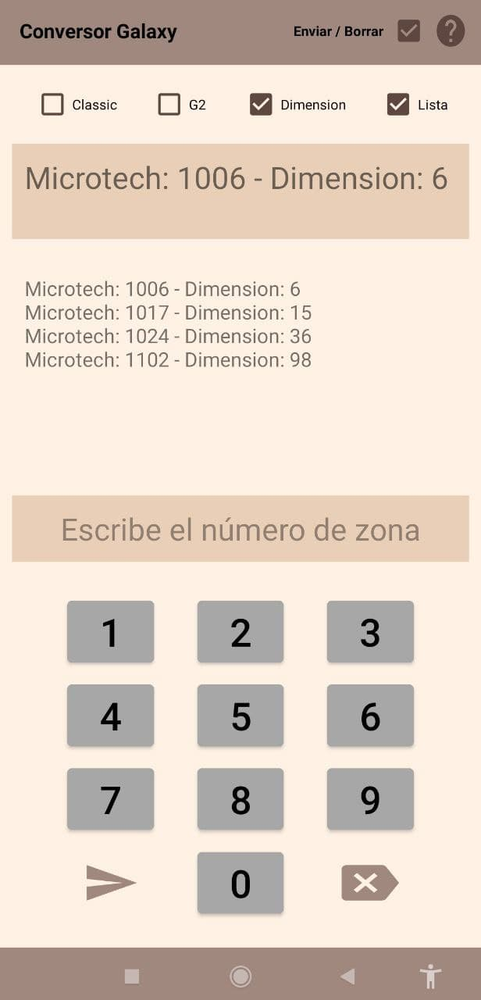

Documentation to be translated.

# Introduction

Few years ago I had to work with the type of alarm systems _Galaxy Dimension_ from _HoneyWell_. It's been quite long since I used to work with them and I might have forgotten some of its specs, but here it goes the reassons for me to make this app.

This app is meant to improve the work performance. Usually, this type of systems are connected to a private security company that monitors the signals sent by the system. The process of checking the system can be confusing when you are trying to know if the sensors bound to the system are sending their sisgnals to the security company. It is because of the way the system assigns an ID to each sensor. The system assigns a number, while the operator can assign a name, to each sensor, and the software to see live signals provided by the security company assings a different ID to the same device. This leads to situations where it is hard to track which ID belongs to each device.

The security company provides a conversion table to track each sensor. This way, the operator can get the ID set by the company knowing the ID set by the system to the device tested, and the other way around. The main problem is that this process heavily slows down the work activity since the operator has to scroll down / up the table to find each device. This process takes a lot of time when the whole system is being tested.

Usually, each system is tested by two operators. Once the whole testing process is over, one of the operators check the log of signals while the other one checks the list of sensors in the company documentation, marking as "Tested" those sensor which where tested with positive result.

* The sensor with the ID 125 is in the log.
* The first operator looks in the conversion table for the zone 125. It belongs to the device numbered by the system with the ID 1135.
* The second operator operator checks, in the documentation provided by the company, whether the sensor with the ID 1135 has already been tested or not, and it sets its state in the documentation.
* The process starts again with a new singal in the log. 

This whole way of working leads to time looses. What happens if both operators are not alone in the building? there will be devices triggered more than once sice other people will trigger the sensors in the most populated areas. This will fill the log with multiple iterations of the same signals. When the log is being checked, the operator reading the log will usually ask the operator checking the documentation wheter an specific ID was already checked or no. The operator won't be able to remember which ones already reported to the second operator if the log is too long and the system has many devices. The second operator will have to check if different devices were already checked or not.

Another problem is the way that the operator browses each zone in the conversion table. The system assigns the ID with numbers in the ranges of 1001 to 1158, 2001 to 2158, 3001 to 3158 and 4001 to 4158. The number used by the system depends on the way the whole system was wired, which dependes on the security needs of the building. Because of this, the log can provide organized information, or just information where a device in the range of 1001 to 1158 reported a signal followed by a device in the range of 3001 to 3158, followed by an array of devices in differente ranges. When the operator is reading the log to the second operator, the one checking the conversion table will have to scroll up / down constantly over the pages.

Both situations were a nonsense for me. Because of this I thought that it could be easy for me to make an app to get the conversion of a device ID, for an specific model of the system. Aditionally, I could add a mode for the app to report if the ID you are introducing was already introduced. This way, the operator has a quick access the conversion of an ID and if it was already checked or not. This way there is no time wasted while scrolling constantly over the conversion table and over the documentation.

 
 

## Funcionamiento 🧰

 

Vamos a empezar entendiendo cómo nombra la central de alarmas sus zonas. La central tiene clemas de conexión para 16 zonas, es decir, puedes conectar a la central 16 sensores. Si se necesitan más sensores se han de agragar ríos y placas expansoras. Se denomina río a la conexión por bus de datos de diferentes elementos que envían y/o reciben información. Una plca expansora, una placa que te permite ampliar X número de sensores, se comunica con la central a través de un río, un bus de comunicaciones, en este caso del tipo RS-485. Esta situación genera que, si necesitas 26 zonas en una central de tipo _Galaxy Classic_, (más adelante veremos los tipos de centrales Galaxy con las que se trabaja), vas a necesitar la central y un total de 2 expansores.

Cada expansor permite agregar un total de 8 zonas. Si al total de 26 zonas del ejemplo anterior, le restamos las 16 que permite agregar la propia central usando el primer bus, nos quedan 10 zonas, por eso se necesitan 2 expansores. Se acomodan 8 de esas 10 zonas en un expansor, y las 2 últimas en el segundo. Cada bus puede contar con un total de 16 conjuntos de 8 zonas, lo que da un total de 128 zonas por bus. Por último, cada central puede contar, según el modelo, con un total de 4 buses. Esto hace posible que se puedan llegar a tener 512 sensores en una instalación. 

Conocer cómo se estructura la arquitectura de conexiones de la central es de vital importancia a la hora de detectar averías, probar el sistema etc. Si tienes una avería en el río 10 del bus 4, y sabes que el bus 4 se encuentra en el lado norte de la instalación, será mucho más fácil localizar las placas relacionadas con la incidencia, especialmente si es la primera vez que acudes a la instalación.

Explicado todo esto, destaca muchisimo lo acertadamente que plasma toda esta información la central en los números identificadores de las zonas. Voy a estender algunos ejemplos y va a quedar completamente claro.

Zona 2036:
* Bus: 2
* Expansor: 03 -> Empezamos a contar desde cero, luego el expansor 00 sería el primer expansor del bus, el expansor 01 sería el segundo, el 02 sería el tercero, y el 03 sería el cuarto.
* Número de zona: 6 -> Esto quiere decir que se trata del cuarto sensor del expansor.

Resumen: Estamos hablando del sexto sensor, del cuarto expansor, del segundo bus de la central.

Zona 1014:
* Bus: 1
* Expansor: 01 -> Cómo se ha indicado, la placa de la central tiene conexiones para las primeras 16 zonas del bus número 1. Luego, las zonas 1 a 8 forman el primer "expansor" built-in en la placa de la central, el expansor 00. Las siguientes 8 zonas forman el 
 segundo "expansor", el 01.
* Número de zona: 4 -> Cuarto sensor del expansor.

Resumen: Cuarto sensor, del segundo expansor, del primer bus de la central.

Zona 3138:
* Bus: 3
* Expansor: 13 -> Expansor físico número 14, expansor lógico número 13.
* Zona 8:

Resumen: Octavo sensor, del expansor número 14 (contándolos físicamente), del bus 3.

Visualmente:

  

La tabla de conversión facilita la conversión para tres modelos de central. Actualmente, dado que hace tiempo que ya no trabajo con ese tipo de equipos, desconozco si solo existen esos tres modelos de central Galaxy o si existen más y solo usabamos esos tres. Cada modelo presenta sus peculiaridades en cuanto a como se enumeran las zonas:

* CLASSIC: Ofrece la posibilidad de conectar hasta 512 sensores. Nombra los sensores de la forma en la que se ha explicado anteriormente.
* G2: Solo pueden conectarse 44 sensores. Nombra las zonas del 1 al 4 como se ha explicado anteriormente, del 1001 al 1004. A partir de la quinta zona se da un salto hasta la 1011. De esta forma, la sexta zona será nombrada como 1012, la septima como 1013, y así hasta la zona 12 que se nombra como 1018. De ahí, siguiendo la explicación, la zona 13 se nombrará como 1021, y se seguirá la lógica de nombramiento hasta la última zona posible de la central, la 44, que será la 1058.
* G3 / Dimension: Ofrece la posibilidad de conectar hasta 512 sensores. Enumera las zonas de forma normal hasta la número 16, es decir, la zona 1018. La zona 1021 que correspondería a la zona 17, en esta central corresponde a la zona 33, y se sigue contando desde ahí. La zona 1022 que correspondería a la zona 18, ahora pasa a corresponder a la zona 34, y de ahí en adelante. De esta forma, en esta central no existen sensores nombrados con la numeración ordinaria del 17 al 32.

Todo esto queda mejor explicado en la propia documentación del código.
 
 
 

## Aplicación 🧰

 

  
  
  

 

Como se puede observar, la interfaz de usuario es bien sencilla, aun tengo trabajo por delante en relación al tema de diseño. Lo único que buscaba activamente era que la gama de colores empleada fuese agradable. No quería contrastes altos, texto de color negro sobre fondo blanco, lo cual puede ser molesto para usuarios que padecen ciertos desordenes oculares. Estoy seguro de que habrá gente con daltonismo a la que los colores elegidos les supondrá un problema. Supongo que en un futuro revisaré este campo.

Usar la aplicación es muy sencillo. La idea principal es introducir el número de zona en cualquier formato y que la aplicación te de la conversión en función del tipo de central seleccionada mediante los check boxes del area superior. Si introduces un número de sensor según la numeración que le ha asignado la central, la aplicación entiende que buscas conocer la numeración normal, y viceversa.

Los check boxes sirven para que el cálculo de zona respete las peculiaridades de cada central. Como se ha explicado anteriormente, no cuentan de la misma manera.

La opción _Lista_ sirve para que la aplicación ordene en el histórico las zonas introducidas de forma descendente. Esto resulta útil si es necesario copiar el histórico para ser reportado. Adicionalmente, cuando esta opción esté seleccionada no se podrán introducir valores duplicados. Se reportará un mensaje indicando que el número de sensor ya fue introducido. De esta forma se solventa la situación no deseada, descrita anteriormente, relacionada con el chequeo de zonas introducidas cuando se trabaja.

