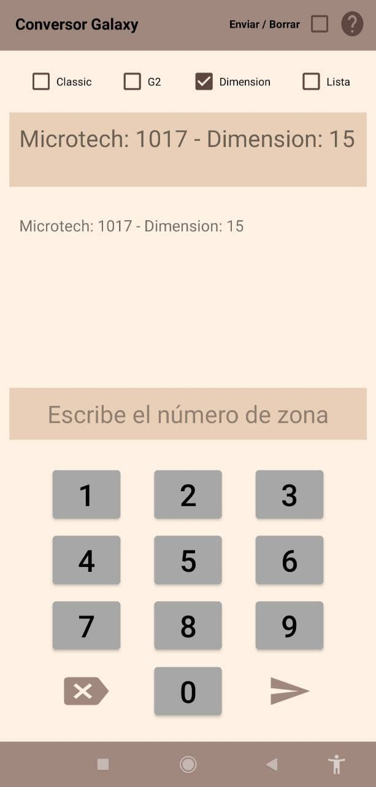

# Introducción

Hubo un momento en el pasado en el que tuve que trabajar con las central de alarmas de intrusión _Galaxy Dimension_, de la marca _HoneyWell_. El tiempo ha hecho que se me hayan olvidado ciertos conceptos e información de la misma, pues hace tiempo que ya no trabajo con estos equipos, pero aquí va el origen de esta aplicación.

Esta aplicación surge de la necesidad de mejorar el rendimiento de trabajo para hacer más liviana una actividad laboral específica. Cuando se trabaja con este tipo de sistemas, amenudo están conectados a una empresa de seguridad privada que supervisa las señales de la misma. Probar el correcto funcionamiento de la central puede resultar confuso cuando se trata de verificar si un un sensor concreto del sistema ha enviado su señal al centro de recepción de señales de la empresa de seguridad. Esto es debido a que la central de alarmas le asigna una identificación basada en un número, al que le puedes agregar un nombre, y el sistema de visualización de señales en directo de la empresa de seguridad le asigna otro número diferente al mismo dispositivo. Cuando revisas las señales que llegan a tu herramienta de trabajo, (móvil, tablet), las visualizas con la numeración que le da el sistema de la empresa de seguridad privada, y para poder verificar que dicha señal recibida corresponde al sensor que estás probando, necesitas una tabla de conversión que te muestre a qué numeración de la central de alarmas corresponde la numeración de la señal recibida en el software de la empresa. Esto genera una demora del trabajo notable cuando se están comprobando todos los sensores de un sistema completo, pues esa tabla se nos facilita en un archivo de texto sobre el que tienes que hacer scroll de forma constante. La situación más común era que, tras haber hecho saltar todos los sensores del sistema, tu compañero y tú os sentabais y mientras uno iba leyendo el histórico de señales, el otro iba marcando como "Probado" cada uno de los sensores en un excel, tras haber consultado la tabla.

* Ha saltado el sensor número 125.
* Se comprueba en la tabla la numeración del sensor 125 en la central de alarmas, que corrsponde con la zona 1135.
* Se comprueba en el Excel de información del cliente si ya se marcó como _Probada_ dicha zona.
* Se pasa al siguiente sensor en el histórico de señales.

Esta dinámica de trabajo genera un inconveniente notable. 쯈ué pasa si tu compañero y tú no estáis solos en la instalación mientras probáis todo el sistema? ocurrirá que habrá sensores que se activen más de una vez debido al paso del personal de la instalación, o de los clientes que acuden a dicha instalación. Esto hace que el historial de señales se sature de los reportes de aquellos sensores que estén en las zonas más transitadas de la instalación. En este caso, cuando se está revisando todo el historial y anotando los sensores probados con éxito, la frase más recurrente es "쯦e he dicho ya la zona X?" donde X es el número de un sensor, (se denomina zona a cada uno de los sensores del sistema). Esto te obliga a perder tiempo revisando el documento para saber si ya le clasificaste como _probada_, porque es posible que no lo recuerdes si la instalación tiene muchos sensores.

Otro inconveniente notable es el de buscar cada zona en la tabla de conversión. Mas adelante en este documento se explicará cómo numera el sistema cada zona, por ahora solo decir que estos sistemas pueden contar con zonas cuya numeración va del 1001 al 1158, del 2001 al 2158, del 3001 al 3158, y del 4001 al 4158. Como la numeración depende de cómo se hayan cubierto las necesidades de seguridad de la instalación, en el historial de señales, tras haber probado el sistema, podemos encontrar reportes de una zona cuya numeración se encuentra  en el rango de 1001 a 1158, seguida de otra zona en el rango de 3001 a 3158, y a continuación otra en cualquier otro rango. Cuando se está revisando el historial, comprobar la tabla de conversión se traduce en un constante proceso de buscar X zona en el documento en su rango adecuado, lugo pasar X número de páginas para buscar la siguiente en su rango, etc.

Estas dos situaciones, a mi parecer, eran un sin sentido. En ese momento pensé que sería sencillo hacer una aplicación que te devuelva el número zona ya convertido, en función del tipo de central. Adicionalmente, podría añadirle un modo de funcionamiento que te reporte si ya introduciste una zona en concreto. De está forma, tendrías acceso a la conversión de la zona de forma rápida y podrías saber si ya comprobaste su estado con anterioridad. Esto eliminaría el constante scroll tanto en el archivo de control donde apuntamos cada zona que ha sido probada, como en la tabla de conversión.

 
 

## Funcionamiento 🧰

 

Vamos a empezar entendiendo cómo nombra la central de alarmas sus zonas. La central tiene clemas de conexión para 16 zonas, es decir, puedes conectar a la central 16 sensores. Si se necesitan más sensores se han de agragar ríos y placas expansoras. Se denomina río a la conexión por bus de datos de diferentes elementos que envían y/o reciben información. Una plca expansora, una placa que te permite ampliar X número de sensores, se comunica con la central a través de un río, un bus de comunicaciones, en este caso del tipo RS-485. Esta situación genera que, si necesitas 26 zonas en una central de tipo _Galaxy Classic_, (más adelante veremos los tipos de centrales Galaxy con las que se trabaja), vas a necesitar la central y un total de 2 expansores.

Cada expansor permite agregar un total de 8 zonas. Si al total de 26 zonas del ejemplo anterior, le restamos las 16 que permite agregar la propia central usando el primer bus, nos quedan 10 zonas, por eso se necesitan 2 expansores. Se acomodan 8 de esas 10 zonas en un expansor, y las 2 últimas en el segundo. Cada bus puede contar con un total de 16 conjuntos de 8 zonas, lo que da un total de 128 zonas por bus. Por último, cada central puede contar, según el modelo, con un total de 4 buses. Esto hace posible que se puedan llegar a tener 512 sensores en una instalación. 

Conocer cómo se estructura la arquitectura de conexiones de la central es de vital importancia a la hora de detectar averías, probar el sistema etc. Si tienes una avería en el río 10 del bus 4, y sabes que el bus 4 se encuentra en el lado norte de la instalación, será mucho más fácil localizar las placas relacionadas con la incidencia, especialmente si es la primera vez que acudes a la instalación.

Explicado todo esto, destaca muchisimo lo acertadamente que plasma toda esta información la central en los números identificadores de las zonas. Voy a estender algunos ejemplos y va a quedar completamente claro.

Zona 2036:
* Bus: 2
* Expansor: 03 -> Empezamos a contar desde cero, luego el expansor 00 sería el primer expansor del bus, el expansor 01 sería el segundo, el 02 sería el tercero, y el 03 sería el cuarto.
* Número de zona: 6 -> Esto quiere decir que se trata del cuarto sensor del expansor.

Resumen: Estamos hablando del sexto sensor, del cuarto expansor, del segundo bus de la central.

Zona 1014:
* Bus: 1
* Expansor: 01 -> Cómo se ha indicado, la placa de la central tiene conexiones para las primeras 16 zonas del bus número 1. Luego, las zonas 1 a 8 forman el primer "expansor" built-in en la placa de la central, el expansor 00. Las siguientes 8 zonas forman el 
 segundo "expansor", el 01.
* Número de zona: 4 -> Cuarto sensor del expansor.

Resumen: Cuarto sensor, del segundo expansor, del primer bus de la central.

Zona 3138:
* Bus: 3
* Expansor: 13 -> Expansor físico número 14, expansor lógico número 13.
* Zona 8:

Resumen: Octavo sensor, del expansor número 14 (contándolos físicamente), del bus 3.

Visualmente:

  

La tabla de conversión facilita la conversión para tres modelos de central. Actualmente, dado que hace tiempo que ya no trabajo con ese tipo de equipos, desconozco si solo existen esos tres modelos de central Galaxy o si existen más y solo usabamos esos tres. Cada modelo presenta sus peculiaridades en cuanto a como se enumeran las zonas:

* CLASSIC: Ofrece la posibilidad de conectar hasta 512 sensores. Nombra los sensores de la forma en la que se ha explicado anteriormente.
* G2: Solo pueden conectarse 44 sensores. Nombra las zonas del 1 al 4 como se ha explicado anteriormente, del 1001 al 1004. A partir de la quinta zona se da un salto hasta la 1011. De esta forma, la sexta zona será nombrada como 1012, la septima como 1013, y así hasta la zona 12 que se nombra como 1018. De ahí, siguiendo la explicación, la zona 13 se nombrará como 1021, y se seguirá la lógica de nombramiento hasta la última zona posible de la central, la 44, que será la 1058.
* G3 / Dimension: Ofrece la posibilidad de conectar hasta 512 sensores. Enumera las zonas de forma normal hasta la número 16, es decir, la zona 1018. La zona 1021 que correspondería a la zona 17, en esta central corresponde a la zona 33, y se sigue contando desde ahí. La zona 1022 que correspondería a la zona 18, ahora pasa a corresponder a la zona 34, y de ahí en adelante. De esta forma, en esta central no existen sensores nombrados con la numeración ordinaria del 17 al 32.

Todo esto queda mejor explicado en la propia documentación del código.
 
 
 

## Aplicación 🧰

 

  
  
  

 

Como se puede observar, la interfaz de usuario es bien sencilla, aun tengo trabajo por delante en relación al tema de diseño. Lo único que buscaba activamente era que la gama de colores empleada fuese agradable. No quería contrastes altos, texto de color negro sobre fondo blanco, lo cual puede ser molesto para usuarios que padecen ciertos desordenes oculares. Estoy seguro de que habrá gente con daltonismo a la que los colores elegidos les supondrá un problema. Supongo que en un futuro revisaré este campo.

Usar la aplicación es muy sencillo. La idea principal es introducir el número de zona en cualquier formato y que la aplicación te de la conversión en función del tipo de central seleccionada mediante los check boxes del area superior. Si introduces un número de sensor según la numeración que le ha asignado la central, la aplicación entiende que buscas conocer la numeración normal, y viceversa.

Los check boxes sirven para que el cálculo de zona respete las peculiaridades de cada central. Como se ha explicado anteriormente, no cuentan de la misma manera.

La opción _Lista_ sirve para que la aplicación ordene en el histórico las zonas introducidas de forma descendente. Esto resulta útil si es necesario copiar el histórico para ser reportado. Adicionalmente, cuando esta opción esté seleccionada no se podrán introducir valores duplicados. Se reportará un mensaje indicando que el número de sensor ya fue introducido. De esta forma se solventa la situación no deseada, descrita anteriormente, relacionada con el chequeo de zonas introducidas cuando se trabaja.

